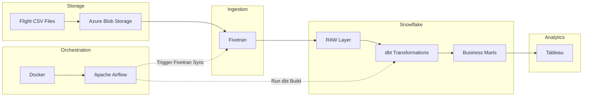
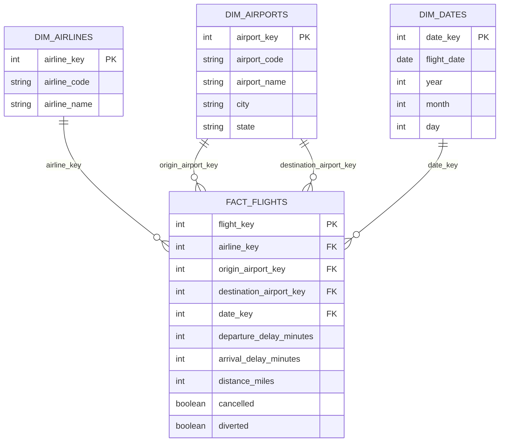

# Flights Data Engineering Pipeline


  

## Project Overview

This project started as a way to build an end-to-end data engineering pipeline using the tools and technologies commonly found in modern cloud data platforms.

The pipeline takes raw flight data stored in Azure Blob Storage, loads it into Snowflake using Fivetran, transforms it with dbt into a dimensional model, orchestrates the workflow using Apache Airflow running in Docker, and finishes by making the data available for reporting in Tableau.

Rather than focusing on a single technology, the goal was to build the complete data journey—from raw files through to analytics-ready data—while following the engineering practices used in production environments.

Throughout the project I focused on building something that was realistic rather than simply making it work. That meant using version control, automated data quality tests, orchestration, modular transformations, and a layered warehouse design.  

## Table of Contents

- [Project Overview](#project-overview)
- [Project Highlights](#project-highlights)
- [Architecture](#architecture)
- [Technologies Used](#technologies-used)
- [Pipeline Walkthrough](#pipeline-walkthrough)
- [Data Model](#data-model)
- [Data Quality & Testing](#data-quality--testing)
- [Engineering Decisions](#engineering-decisions)
- [Future Improvements](#future-improvements)
- [Repository Structure](#repository-structure)
- [Conclusion](#conclusion)  

## Project Highlights

- End-to-end cloud data engineering pipeline
- Azure Blob Storage used as the landing zone
- Automated data ingestion with Fivetran
- Snowflake cloud data warehouse
- Layered dbt transformation architecture
- Star schema dimensional model
- Apache Airflow orchestration
- Incremental file ingestion
- Automated data quality testing
- Tableau analytics-ready reporting  

## Architecture

The pipeline follows an ELT architecture. Raw flight data is uploaded to Azure Blob Storage, ingested into Snowflake using Fivetran, transformed with dbt into analytics-ready business marts, and visualised in Tableau. Apache Airflow orchestrates the ingestion and transformation workflow.



---

## Technologies Used

| Technology | Purpose |
|------------|---------|
| **Azure Blob Storage** | Stores the raw flight data files before they are ingested into the data warehouse. |
| **Fivetran** | Loads data from Azure Blob Storage into Snowflake and manages incremental ingestion. |
| **Snowflake** | Serves as the cloud data warehouse for storing raw, transformed and analytics-ready data. |
| **dbt** | Transforms the raw data into a layered warehouse model, applies data quality tests and builds the dimensional model. |
| **Apache Airflow** | Orchestrates the pipeline by triggering the Fivetran sync and running the dbt transformation workflow. |
| **Docker & Docker Compose** | Containerise the Apache Airflow environment, providing a consistent, reproducible, and isolated development and orchestration platform. |
| **Tableau** | Connects to the business marts to create analytics-ready visualisations. |
| **Git & GitHub** | Used for version control and project documentation throughout development. |

## Pipeline Walkthrough

The pipeline follows a straightforward ELT workflow, taking raw flight data from cloud storage through to analytics-ready business marts.

### 1. Landing the data

The pipeline begins with CSV files containing flight data being uploaded to Azure Blob Storage. This acts as the landing zone and provides a central location for new data before it is ingested into the warehouse.

**Azure Blob Storage container**
  


---

### 2. Data ingestion with Fivetran

Fivetran monitors the storage container and automatically loads new files into the RAW layer of Snowflake. Incremental ingestion was validated by loading multiple source files and confirming that only new records were processed.

**Fivetran Azure connector test**  
  

---

**Fivetran connector successful sync**  
  

---

**Snowflake file ingestion from fivetran** 


---

### 3. Data transformation with dbt

Once the raw data is available, dbt transforms it through several layers:

- **Staging** – standardises column names, data types and formats.
- **Intermediate** – applies business rules and enriches the data.
- **Dimensions & Facts** – builds a star schema for analytics.
- **Business Marts** – creates reporting-ready datasets for Tableau.

Automated dbt tests are executed throughout the transformation process to help maintain data quality.

**dbt stg_flights lineage graph**  
  

---

**dbt fact_flights lineage graph**
  

---

**dbt cloud tests passed**  
  

---

**dbt cloud dbt build passed**  
  


---

### 4. Pipeline orchestration with Apache Airflow

Apache Airflow orchestrates the pipeline by triggering the Fivetran sync, waiting for the ingestion to complete, and then executing the dbt transformation job. This ensures each stage runs in the correct order.


**airflow successful dag run**  
  

---

**airflow dag workflow**  
  

---

**dbt cloud flights build job lineage graph**  
  


---

### 5. Analytics with Tableau

The curated business marts are connected directly to Tableau to produce reporting-ready visualisations that demonstrate how the transformed data can be used for reporting and analysis.


**Top 10 Total Flights by Airline**  
  

---

**Average Departure Delays - Airline**  
  

---

**Top 15 average departure delays by airport**  
  

---

**Top 10 Airports by total departures**  
  


## Data Model

The data is modelled using a star schema to support reporting and analytical queries. A central fact table stores the flight activity, while dimension tables provide descriptive information about airlines, airports and dates. This structure keeps the model easy to understand and is a common approach in modern data warehouse design.  

**Star Schema**  




## Data Quality & Testing

Data quality is built directly into the transformation layer using dbt's testing framework. Automated tests are executed as part of the pipeline to help ensure the transformed data is accurate, consistent and ready for reporting.

The project includes tests for:

- Primary key uniqueness
- Mandatory fields (`not_null`)
- Accepted values
- Referential integrity between fact and dimension tables

Running `dbt build` executes both the transformations and the associated tests, providing confidence that the data model is valid before it is consumed by downstream reporting.   

## Engineering Decisions

Building the project involved more than connecting technologies together. Several design decisions were made to keep the pipeline simple, maintainable and representative of a modern data engineering workflow.

### ELT over ETL

The project follows an ELT approach, where data is first loaded into Snowflake before being transformed with dbt. This keeps the raw data unchanged and allows transformations to be version controlled, tested and rerun whenever needed.

### Layered dbt Models

The transformation layer is organised into staging, intermediate, dimensional and business mart models. Separating responsibilities across these layers makes the project easier to maintain, test and extend as new requirements are introduced.

### Star Schema Design

The analytical layer uses a star schema with a central fact table and supporting dimension tables. This structure is widely used in data warehousing because it provides a simple and efficient model for reporting and analytical queries.

### Airflow and Fivetran Integration

The original design planned to use the official Fivetran Airflow provider. During development, a compatibility issue was encountered with the provider and the version of Apache Airflow used in this project.

Rather than downgrading Airflow or introducing unnecessary complexity, the pipeline triggers Fivetran using the REST API from a PythonOperator. This keeps the workflow compatible with the latest Airflow release while still providing reliable orchestration.

### Containerisation with Docker

Apache Airflow was deployed using Docker and Docker Compose to provide a consistent, isolated, and reproducible development environment. Containerising the orchestration layer simplified local setup, dependency management, and ensured the pipeline could be run consistently across different environments.

### Data Quality

Data quality checks are integrated into the transformation process using dbt tests. Running these tests as part of the pipeline helps identify issues early and ensures the analytical models remain consistent as new data is ingested.

### Incremental dbt Models

The transformation models use standard table and view materialisations rather than incremental models. Given the size of the dataset, rebuilding the models during each pipeline run has minimal impact on performance while keeping the implementation simple, transparent and easy to maintain.

If the project were processing significantly larger volumes of data, incremental materialisations would be a logical optimisation. Processing only new or changed records would reduce execution time and improve scalability while maintaining the same transformation logic.  

## Future Improvements

Although the project meets its original objectives, there are several areas that could be explored as future enhancements:

- Implement incremental dbt models as the volume of source data grows.
- Introduce Infrastructure as Code (Terraform or Bicep) to automate cloud resource provisioning.
- Add CI/CD pipelines for automated testing and deployment using GitHub Actions.
- Expand the dimensional model with additional business metrics and reporting marts.
- Implement pipeline monitoring and alerting for improved operational visibility.
- Add source freshness monitoring and automated notifications for data quality issues.  

## Repository Structure

```text
flights-data-engineering-project/
│
├── airflow/              # Airflow DAGs and supporting code
├── dbt/                  # dbt models, tests and macros
├── docs/
│   └── images/           # Screenshots used throughout the README
├── sql/                  # Snowflake setup and validation scripts
└── README.md
```

## Conclusion

This project demonstrates the design and implementation of an end-to-end cloud data engineering pipeline using modern ELT practices. It combines automated data ingestion, cloud data warehousing, transformation, orchestration and analytics into a single workflow while following engineering practices such as version control, modular development and automated testing.

Building this project provided practical experience across the complete data lifecycle and reinforced the importance of designing solutions that are simple, maintainable and scalable.   

