# Flights Data Engineering Pipeline

## Project Overview

This project started as a way to build an end-to-end data engineering pipeline using the tools and technologies commonly found in modern cloud data platforms.

The pipeline takes raw flight data stored in Azure Blob Storage, loads it into Snowflake using Fivetran, transforms it with dbt into a dimensional model, orchestrates the workflow with Apache Airflow, and finishes by making the data available for reporting in Tableau.

Rather than focusing on a single technology, the goal was to build the complete data journey—from raw files through to analytics-ready data—while following the engineering practices used in production environments.

Throughout the project I focused on building something that was realistic rather than simply making it work. That meant using version control, automated data quality tests, orchestration, modular transformations, and a layered warehouse design.

## Project Highlights

- End-to-end cloud data engineering pipeline
- Azure Blob Storage used as the landing zone
- Automated data ingestion with Fivetran
- Snowflake cloud data warehouse
- Layered dbt transformation architecture
- Star schema dimensional model
- Apache Airflow orchestration
- Incremental file ingestion
- Automated data quality testing
- Tableau analytics-ready reporting

## Technologies Used

| Technology | Purpose |
|------------|---------|
| **Azure Blob Storage** | Stores the raw flight data files before they are ingested into the data warehouse. |
| **Fivetran** | Loads data from Azure Blob Storage into Snowflake and manages incremental ingestion. |
| **Snowflake** | Serves as the cloud data warehouse for storing raw, transformed and analytics-ready data. |
| **dbt** | Transforms the raw data into a layered warehouse model, applies data quality tests and builds the dimensional model. |
| **Apache Airflow** | Orchestrates the pipeline by triggering the Fivetran sync and running the dbt transformation workflow. |
| **Tableau** | Connects to the business marts to create analytics-ready visualisations. |
| **Git & GitHub** | Used for version control and project documentation throughout development. |

## Pipeline Walkthrough

The pipeline follows a straightforward ELT workflow, taking raw flight data from cloud storage through to analytics-ready business marts.

### 1. Landing the data

The pipeline begins with CSV files containing flight data being uploaded to Azure Blob Storage. This acts as the landing zone and provides a central location for new data before it is ingested into the warehouse.

**Azure Blob Storage container**
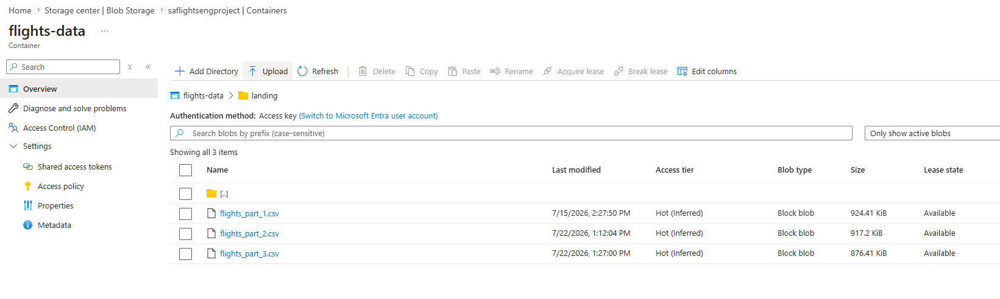  

---

### 2. Data ingestion with Fivetran

Fivetran monitors the storage container and automatically loads new files into the RAW layer of Snowflake. Incremental ingestion was validated by loading multiple source files and confirming that only new records were processed.

**Fivetran Azure connector test**  
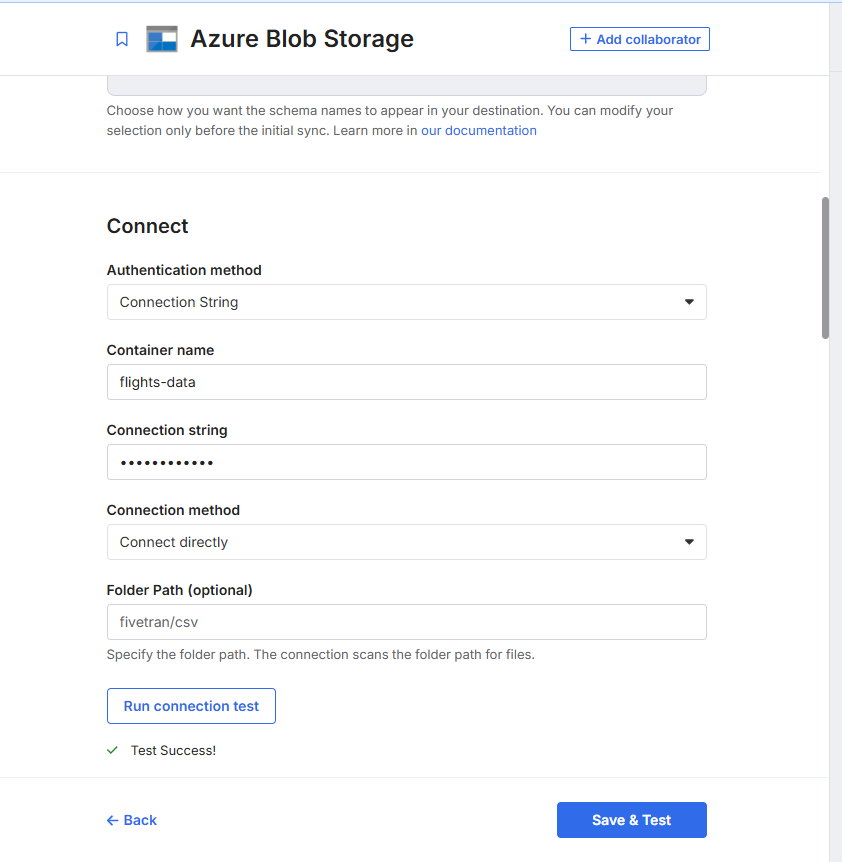  

---
**Fivetran connector successful sync**  
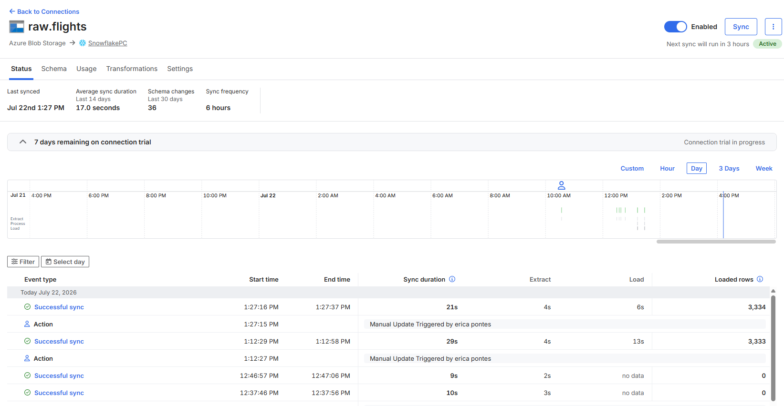  
---
**Snowflake file ingestion from fivetran** 
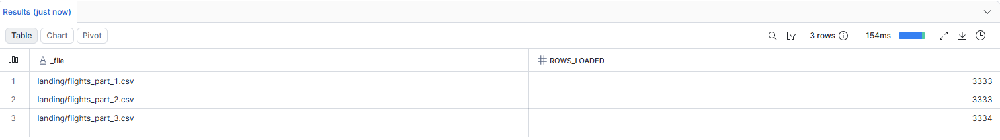

---

### 3. Data transformation with dbt

Once the raw data is available, dbt transforms it through several layers:

- **Staging** – standardises column names, data types and formats.
- **Intermediate** – applies business rules and enriches the data.
- **Dimensions & Facts** – builds a star schema for analytics.
- **Business Marts** – creates reporting-ready datasets for Tableau.

Automated dbt tests are executed throughout the transformation process to help maintain data quality.

**dbt stg_flights lineage graph**  
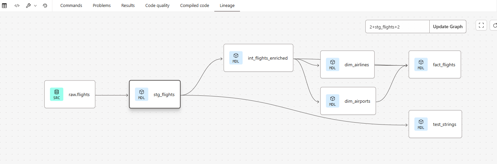  

---

**dbt fact_flights lineage graph**
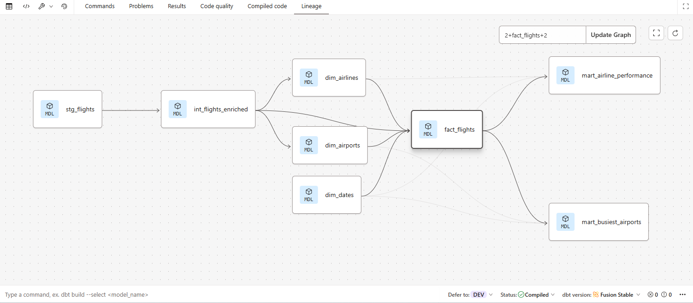  

---

**dbt cloud tests passed**  
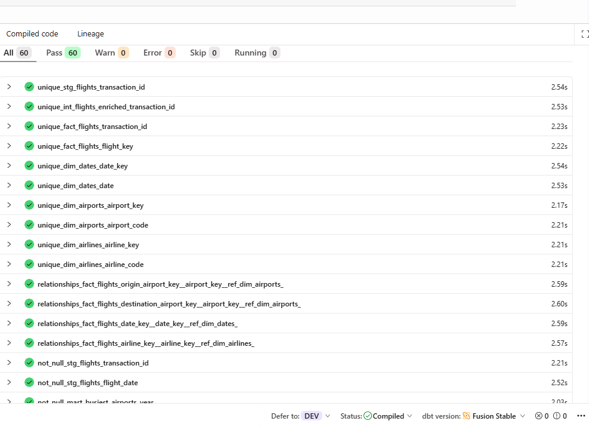  

---

**dbt cloud dbt build passed**  
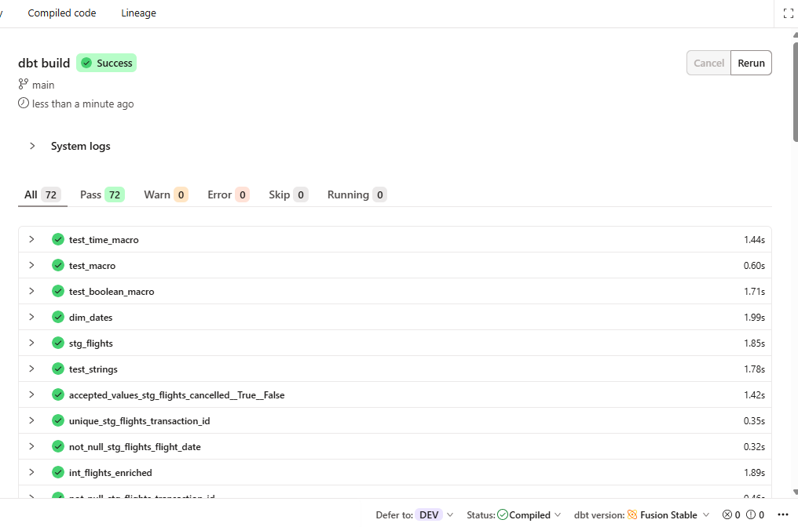  

---

### 4. Pipeline orchestration with Apache Airflow

Apache Airflow orchestrates the pipeline by triggering the Fivetran sync, waiting for the ingestion to complete, and then executing the dbt transformation job. This ensures each stage runs in the correct order.

**airflow successful dag run**  
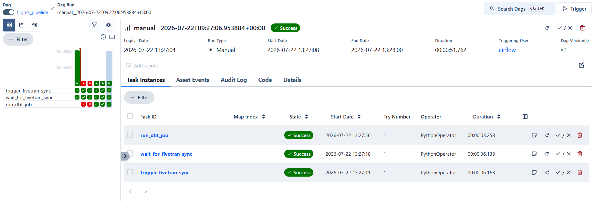  

---

**airflow dag workflow**  
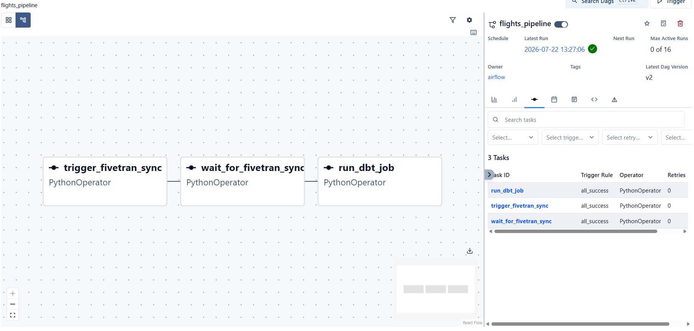  

---

**dbt cloud flights build job lineage graph**  
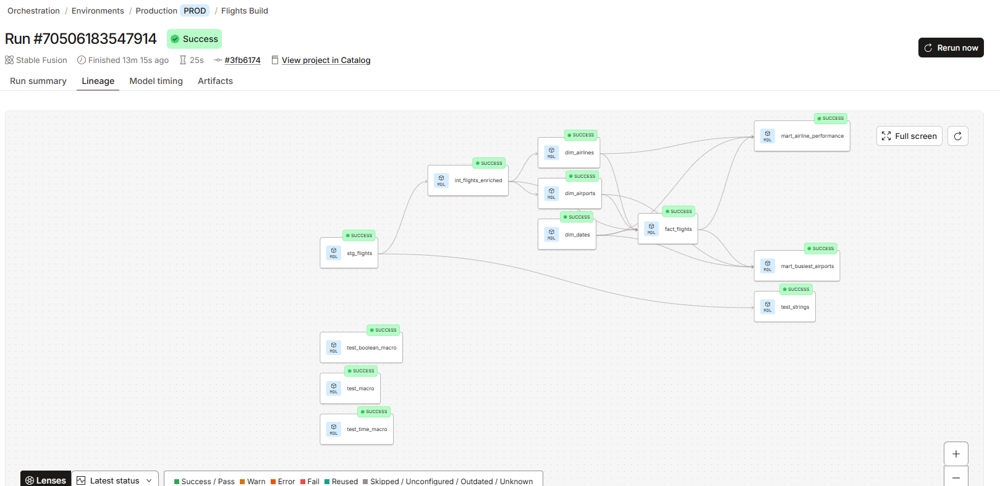  

---

### 5. Analytics with Tableau

The curated business marts are connected directly to Tableau to produce reporting-ready visualisations that demonstrate how the transformed data can be used for reporting and analysis.

**Top 10 Total Flights by Airline**  
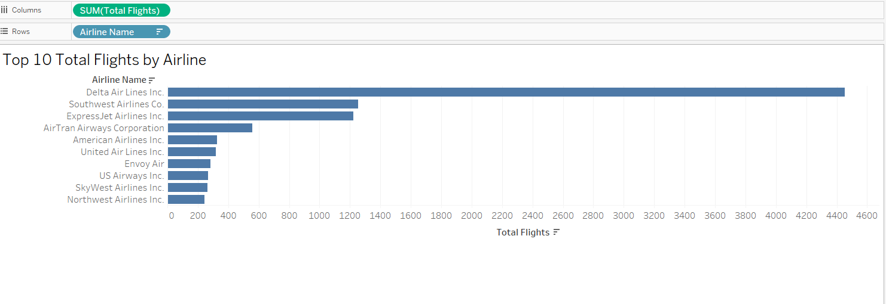  

---

**Average Departure Delays - Airline**  
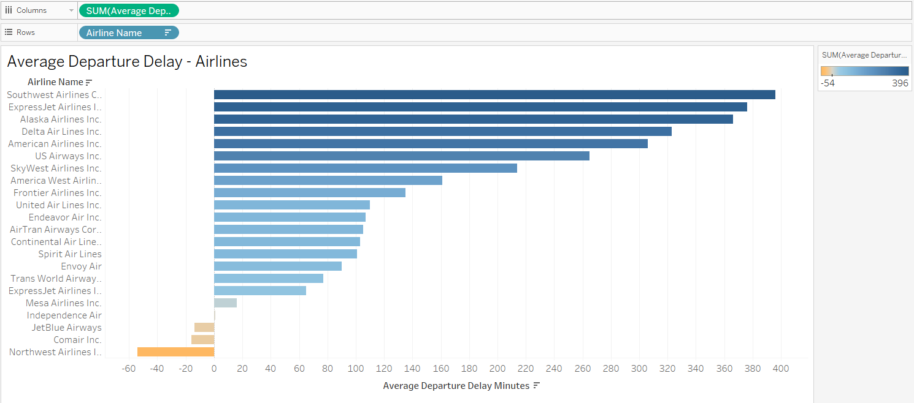  

---

**Top 15 average departure delays by airport**  
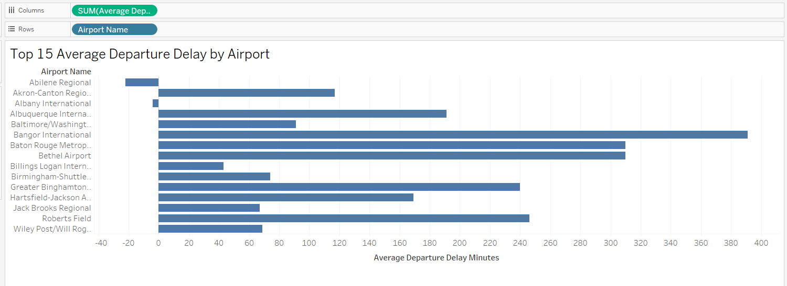  

---

**Top 10 Airports by total departures**  
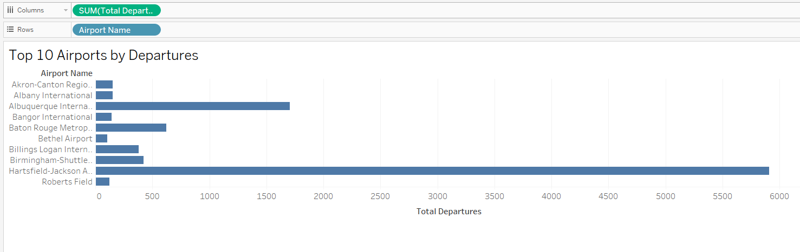  

